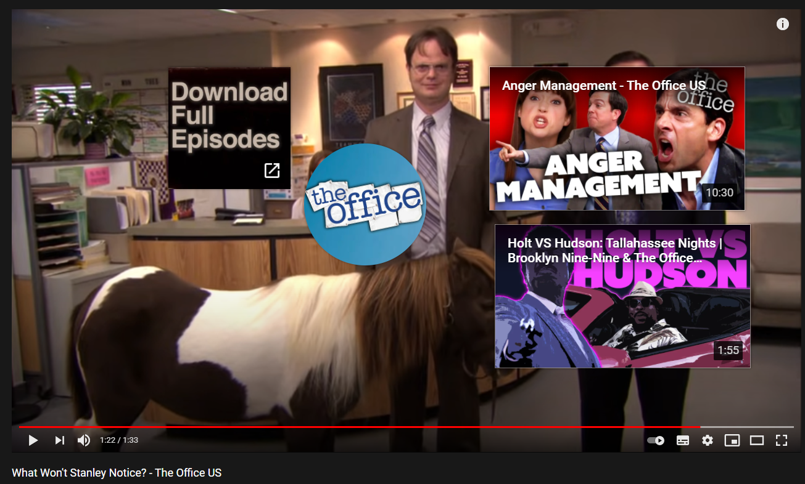
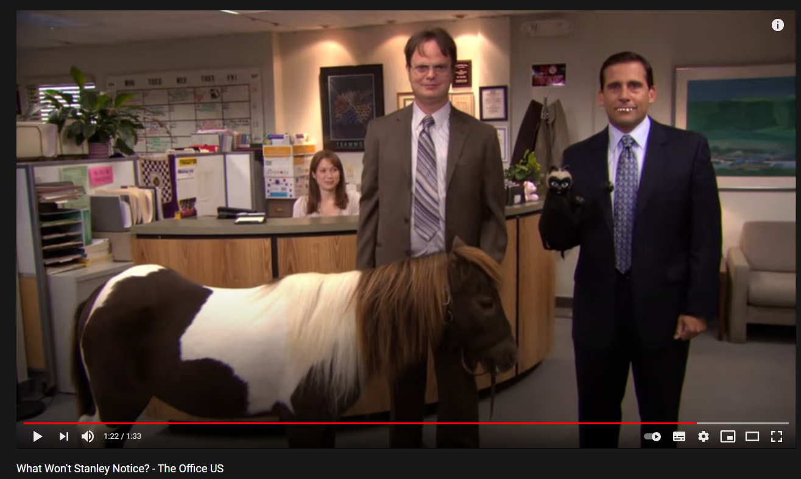

# Remove youtube thumbnails

An extension for chrome to hide the annoying thumbnails from youtube.

## Example

| Before  | After |
| ------------- | ------------- |
|   |  |
## Usage 

1. Just download or clone this repository.
1. (Using developer mode in chrome) Add the extension by pointing to the directory.
1. Done :)

## Icon author

Icons made by <a href="https://www.flaticon.com/authors/dinosoftlabs" title="DinosoftLabs">DinosoftLabs</a> from <a href="https://www.flaticon.com/" title="Flaticon">www.flaticon.com</a>
